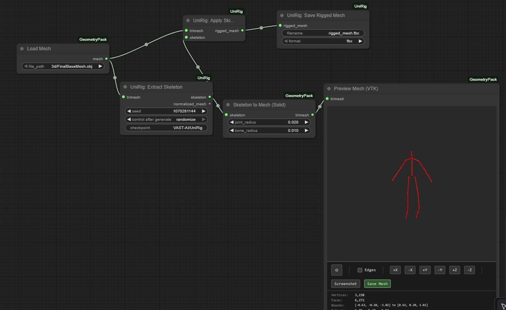

# ComfyUI-UniRig

Automatic skeleton extraction for ComfyUI using UniRig (SIGGRAPH 2025). Self-contained with bundled Blender and UniRig code.


## Installation

### Via ComfyUI Manager (Recommended)

1. Install through ComfyUI Manager
2. Dependencies install automatically
3. Blender auto-installs on first use
4. Ready to go!

### Manual Installation

1. Clone into ComfyUI custom nodes:
   ```bash
   cd ComfyUI/custom_nodes
   git clone https://github.com/YOUR_USERNAME/ComfyUI-UniRig.git
   ```

2. Install dependencies:
   ```bash
   cd ComfyUI-UniRig
   pip install -r requirements.txt
   ```

3. Blender auto-installs on first use

## Usage

**UniRig: Extract Skeleton** - Extracts skeleton from any 3D mesh
- Input: TRIMESH mesh
- Output: SKELETON (joints + bones, normalized to [-1,1])

**UniRig: Extract Full Rig** - Extracts skeleton with skinning weights
- Input: TRIMESH mesh
- Output: TRIMESH rigged mesh

## Requirements

- CUDA GPU (8GB+ VRAM recommended)
- PyTorch with CUDA support (usually already installed with ComfyUI)

## Features

- **State-of-the-art**: Based on UniRig (SIGGRAPH 2025)
- **Self-contained**: Bundled UniRig code and auto-installing Blender
- **Universal**: Works on humans, animals, objects, any 3D mesh
- **Fast**: Optimized inference pipeline
- **Easy**: One-click install via ComfyUI Manager

## Links

- [UniRig Paper](https://zjp-shadow.github.io/works/UniRig/)
- [UniRig GitHub](https://github.com/VAST-AI-Research/UniRig)
